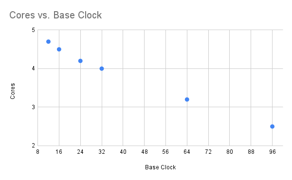

# Development Workstation

The right equipment will help significantly during development. The wrong
equipment can be incredibly painful.

## Operating system

We have standardized on Linux for Nerves development, as well as for firmware
development in general. The architecture should be `x86_64` to avoid issues
with cross-compilation and host tooling.

Linux has become well-supported by many vendors, and provides tools and
paradigms that make it easier to develop software. Since Nerves firmware runs
embedded Linux, Linux experience can translate between the desktop, server,
and embedded.

The Linux distribution is less critical. The important part is for a developer
to be proficient with their Linux environment. For developers who are not yet
experienced with Linux, we recommend starting with [Ubuntu Desktop](https://ubuntu.com/download/desktop)
due to its wide support and ability to find information about it easily with a
web search.

## Virtualization

It is a good idea to create the development environment inside of a virtual
machine. This offers several benefits:

- Isolation of development data from business software.
- Isolated networking.
- Dedicated disk encryption on the virtual machine's virtual drive.
- Periodic snapshots that can be restored in case of a disaster.
- Portability to other computers in case of hardware failure or upgrades.

We prefer [VMware Workstation Pro](https://www.vmware.com/products/workstation-pro.html) for virtualization. A free alternative
we have had good experience with is [Oracle VirtualBox](https://www.virtualbox.org/),
but it is more limited.

## Hardware selection

For application firmware development that does not involve compiling Nerves
systems, a computer with above-average specs will likely be sufficient. This
will be the case if a platform development team creates the artifacts for an
application development team.

For Nerves system development (platform development), we prefer [AMD Threadripper](https://www.amd.com/en/processors/ryzen-threadripper-pro)
workstations. These high performance workstations are capable of compiling
several Nerves systems per hour from a clean build, significantly reducing the
amount of time it takes to iterate through the development of a Nerves system.

### More cores or faster clock?

When looking at Threadripper CPUs, there is a point where you have to choose
between significantly more cores at the cost of significantly lower base clock
speed. More cores will benefit parallel workloads, whereas a faster clock is
better when workloads are single-threaded or don't parallelize well.

So is Nerves system compilation parallel or single-threaded? Well, unfortunately
it's a mix of both. Linux and Erlang are packages that support multi-core
compilation. A lot of the ancillary packages tend to compile single-threaded.

> ⚠️ **Trap**
> 
> *"I can write a script that compiles the ancillary packages in parallel to
> utilize the idle cores!"*
> 
> Buildroot already has a setting to enable parallel builds. The catch isn't
> compiling packages in parallel, it's setting up the dependency tree between
> packages so that the right ones can compile in parallel. Nerves just hasn't
> been optimized for this yet. It's a topic we occasionally revisit, but in
> general having the right workstation has mitigated most of this pain point.

The following diagram illustrates the difference between cores and clock speed
for the Threadripper Pro 7000 series. For this CPU series, a good balance
between cores and clock speed is the 7975WX 32 core 4.0GHz CPU. Also note that
as of January 2024, VMware supports passing through a maximum of 32 cores to a
virtual machine.

| Model | Cores | Base Clock |
| ----- | ----- | ---------- |
| 7945WX | 12 | 4.7 |
| 7955WX | 16 | 4.5 |
| 7965WX | 24 | 4.2 |
| 7975WX | 32 | 4.0 |
| 7985WX | 64 | 3.2 |
| 7995WX | 96 | 2.5 |
