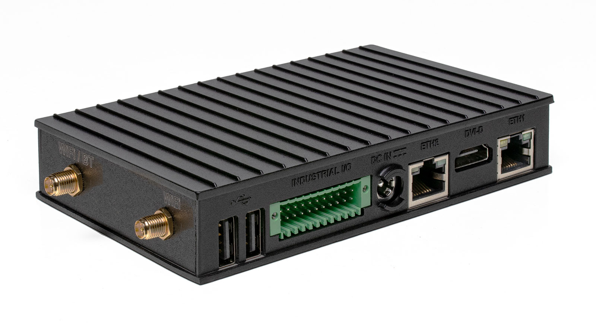
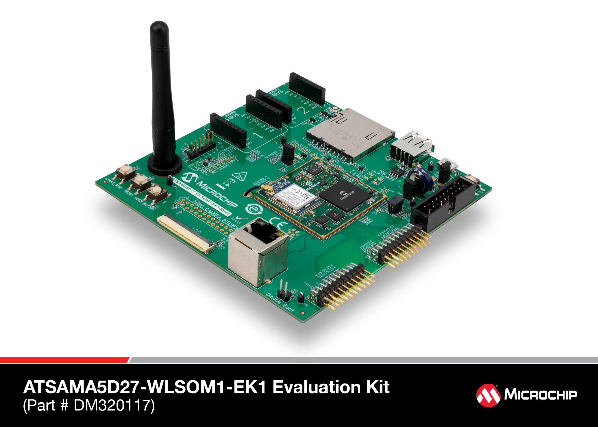
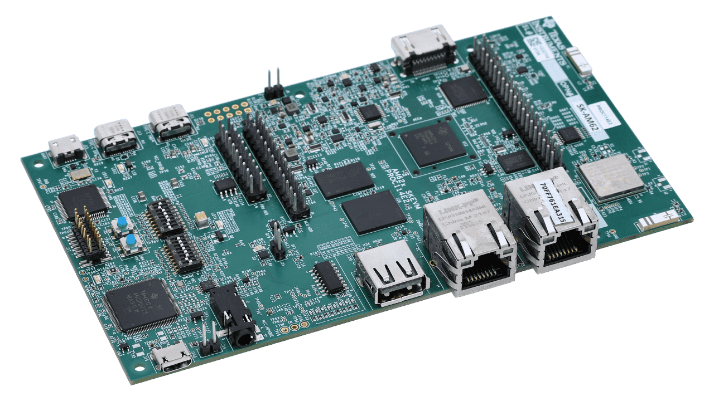
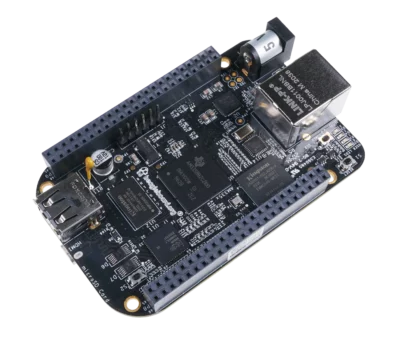

# Nerves systems for commercial products

The Nerves systems and development kits below are reference designs for creating the PCB and Nerves board support for your product. Prototyping can start on the development kit with one of these Nerves systems. When your PCB is manufactured, create a hard fork of the Nerves system, name it after your product, and modify it for your board.

If you need support for a hardware target, [Redwire Labs](https://www.redwirelabs.com/) can create a custom Nerves system for your project.

| Target                                  | System                                                                                                  | Tag    |
| --------------------------------------- | ------------------------------------------------------------------------------------------------------- | ------ |
| 
Compulab

IOT-GATE-IMX8PLUS
 | [nerves\_system\_iot\_gate\_imx8plus](https://github.com/redwirelabs/nerves_system_iot_gate_imx8plus)   | `gate` |
| Microchip SAMA5D27                      | [nerves\_system\_sama5d27\_wlsom1\_ek](https://github.com/redwirelabs/nerves_system_sama5d27_wlsom1_ek) | `sam`  |
| Texas Instruments AM62x                 | [nerves\_system\_ti\_am62x](https://github.com/redwirelabs/nerves_system_ti_am62x)                      | `am62` |
| Texas Instruments AM335x                | [nerves\_system\_bbb](https://github.com/nerves-project/nerves_system_bbb)                              | `bbb`  |

## Compulab IOT-GATE-IMX8PLUS

Industrial IoT gateway

[Manufacturer website](https://www.compulab.com/products/iot-gateways/iot-gate-imx8plus-industrial-arm-iot-gateway/)

<figure><figcaption></figcaption></figure>

## Microchip SAMA5D27

500 MHz ARM Cortex-A5

[Manufacturer website](https://www.microchip.com/en-us/development-tool/dm320117)

## Texas Instruments AM62x

Up to quad 1.4 GHz ARM Cortex-A53

[Manufacturer website](https://www.ti.com/tool/SK-AM62)

## Texas Instruments AM335x

1 GHz ARM Cortex-A8

[Manufacturer website](https://www.ti.com/lit/ds/symlink/am3356.pdf)

