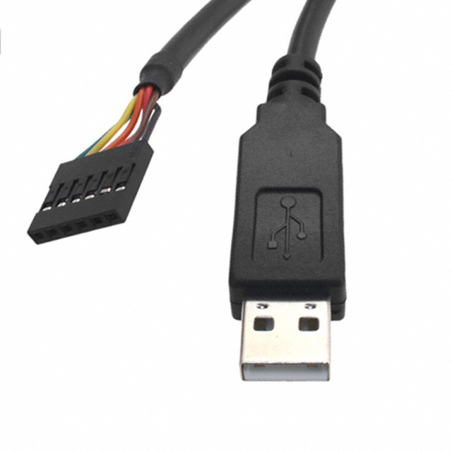
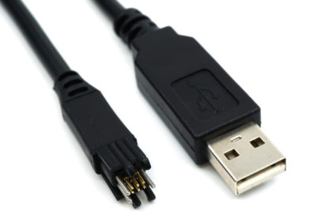
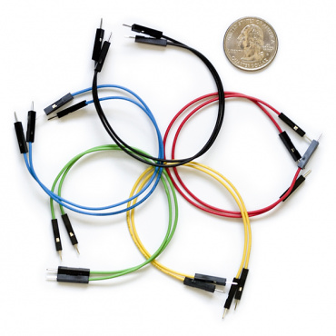

# Serial Cable

A serial cable is required for professional development. This is necessary to
connect to the microprocessor's console port, which will output logs on bootup,
allow access to the U-Boot console, and the Elixir IEx console. It is also
helpful for troubleshooting other devices with serial ports, like
microcontrollers, cellular modems, etc.

Serial cables come in many different varieties, and it doesn't hurt to have
different types to suit the different projects you may work on. The two most
important things to consider when selecting a serial cable are the electrical
interface and connector type. Most development kits will expose a 3.3V TTL
interface via a 0.1" pitch header, which is designed to connect to the
[FTDI TTL-232R-3V3](https://www.digikey.com/en/products/detail/ftdi-future-technology-devices-international-ltd/TTL-232R-3V3/1836393)
cable. FTDI's drivers are also included with modern versions of Linux and
Windows, so the cables work out of the box. On Linux the serial port will show
up as `/dev/ttyUSB0`.

Applications like `picocom` or `screen` can be used to connect to a serial port
from the terminal.

[FTDI TTL-232R-3V3](https://www.digikey.com/en/products/detail/ftdi-future-technology-devices-international-ltd/TTL-232R-3V3/1836393)

> ⚠️ **Trap**
> 
> *"I can buy a serial cable for much less on Amazon."*
>
> An off-brand cable may not come with drivers, may not support your operating
> system, may not follow the FTDI pinout, and may not be the right voltage. A
> serial cable will get used frequently and will be with you a long time. Get
> the quality cable.

## Tag Connect

Another popular connector for the console port is Tag Connect's 6-pin footprint.
This tends to be found on prototype and production PCBs, and saves space. The
connectors can be ordered with or without "legs". The legs are the plastic clips
that hold the connector onto the PCB. The legged version is intended for
prototyping, whereas the no legs version is designed to be mounted in a fixture.
The no legs version also has a smaller footprint. If you need to use a no legs
cable without a fixture, check out the [GRIP-6](https://www.tag-connect.com/product/grip-6-3-pack).

[Tag Connect TC2030-FTDI-TTL-232R-3V3](https://www.tag-connect.com/product/tc2030-ftdi-ttl-232r-3v3)

## Jumper Wires

Sometimes it may be necessary to use an FTDI cable with a serial port header
that doesn't match the FTDI pinout. In this case, 0.1" jumper wires can be used
to connect the pins from the serial cable to the correct pins on the header.

[6" Mixed Jumper Wires](https://www.sparkfun.com/products/9194)

## Gadget Mode

> ⚠️ **Trap**
> 
> *"The Nerves docs say I can connect to the hardware with USB [gadget mode](https://hexdocs.pm/nerves/connecting-to-a-nerves-target.html#gadget-mode-virtual-serial-connection)."*

The official Nerves systems expose the IEx console via a USB gadget mode network
interface. When a USB cable is connected between the computer and dev kit, an
SSH connection can be used to get to the Nerves IEx console on the dev kit.

Although this is great for trying out Nerves, it's not a good method for
professional development. Standing up or modifying a Nerves system often
involves needing to read the logs while the system boots, before the SSH daemon
comes up. It can also be necessary to access U-Boot before the kernel starts.
The best way to do this is by connecting a serial cable. Not to mention your
product typically shouldn't expose its console to end users when they plug in a
USB cable.
